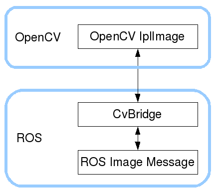

## cv_bridge/ Tutorials/ ConvertingBetweenROSImageAndOpenCVImagePython


---

## ROS Image 토픽과 OpenCV Image 간의 상호 변환  

**출처 :**  <http://wiki.ros.org/cv_bridge/Tutorials/ConvertingBetweenROSImagesAndOpenCVImagesPython>

**튜토리얼 레벨 :**  중급

**선수 학습 :**  ROS 튜토리얼 

**이전 튜토리얼 :** 

**다음 튜토리얼 :** 

**빌드 환경 :**  colcon **/** Ubuntu 20.04 **/** Foxy

---

ROS에서 `uvc_cam`과 같은 카메라 관련 노드를 구동하면 카메라 영상이 토픽으로 발행된다. 이 여영상 토픽을 `OpenCV`를 이용해 처리하는 방법을 알아보자. 

`usb_cam`노드 실행

```
ros2 run usb_cam usb_cam_node_exe
```

`usb_cam`노드 실행 후 토픽 리스트 확인


```
ros2 topic list 
/camera_info
/image_raw
/image_raw/compressed
/image_raw/compressedDepth
/image_raw/theora
/parameter_events
/rosout
```

리스트 중 카메라 영상 토픽은 `/image_raw` 이다. `rqt` 등에서 영상을 학인 하려면 이 토픽을 선택해 주어야 한다. 

`/image_raw` 토픽의 `type` 을 확인해 보자. 

```
ros2 topic type /image_raw
sensor_msgs/msg/Image

IplImage


```

 `/image_raw` 토픽의 형식은 `sensor_msgs/msg/Image` 라는 것을 알 수 있다. 하지만 불행히도 이 형식은 OpenCV 라이브러리에서 사용하는`IplImage` 또는 `mat` 형식과 호환되지 않는다. 따라서 ROS의 이미지 토픽을 `subscribe` 하여 OpenCV로 처리하기 위해서는 적절한 형식 변환이 이루어져야 한다. 이러한 ROS 이미지 토픽과 OpenCV 사이의 형식 변환 방법을 제공해 주는 ROS 패키지가 바로 `cv_bridge` 이다. 아래 그림 참고.	


CvBridge 와 OpenCV 라이브러리를 사용하여 `/image_raw` 토픽을 그레이스케일로 변환하여 토픽명 `/image_gray` 으로 재발행하는 노드 예제를 작성해보자.

작업 경로를 `~/robot_ws/src` 로 변경

```
cd ~/robot_ws/src
```

ROS 노드 패키지 `ropencv` 생성

```
ros2 pkg create opencv --build-type ament_python --dependencies rclpy
```

작업 경로를 `~/catkin_ws/src/opencv/opencv` 로 변경

```
cd ~/robot_ws/src/opencv/opencv
```

`script` 폴더 생성 후 작업 경로 변경

```
mkdir script && cd script
```

`cv_bridge` 패키지 설치

```
sudo apt install ros-foxy-cv-bridge
```


`grayscale.py` 편집

```
gedit  grayscale.py &
```


```python
import rclpy 
from rclpy.node import Node
from sensor_msgs.msg import Image
from cv_bridge import CvBridge
import cv2
 
class ImageConvertor(Node):
  def __init__(self):
    super().__init__('image_subscriber')
    self.subscription = self.create_subscription(
      Image, 
      '/image_raw', 
      self.get_img_cb, 
      10)
    self.img_pub = self.create_publisher(Image, 'image_gray', 10)
    self.subscription # prevent unused variable warning
      
    # Used to convert between ROS and OpenCV images
    self.bridge = CvBridge()
   
  def get_img_cb(self, msg):
    #self.get_logger().info('---')
 
    cv_img = self.bridge.imgmsg_to_cv2(msg, "bgr8")
    img_gray = cv2.cvtColor(cv_img, cv2.COLOR_BGR2GRAY)
    '''
    cv2.imshow("grayscale", img_gray)
    
    cv2.waitKey(1)
    '''
    img_msg = self.bridge.cv2_to_imgmsg(img_gray)
    self.img_pub.publish(img_msg)
def main(args=None):
  
  # Initialize the rclpy library
  rclpy.init(args=args)
  
  # Create the node
  node = ImageConvertor()
  
  # Spin the node so the callback function is called.
  rclpy.spin(node)
  
  # Destroy the node explicitly
  # (optional - otherwise it will be done automatically
  # when the garbage collector destroys the node object)
  image_subscriber.destroy_node()
  
  # Shutdown the ROS client library for Python
  rclpy.shutdown()
  
if __name__ == '__main__':
  main()
```


`setup.py` 편집을 위해 작업경로를 `~/robot_ws/src/opencv` 로 변경한다. 

```
cd ~/robot_ws/src/opencv
```

`setup.py` 편집

```
gedit setup.py
```


```python
from setuptools import find_packages
from setuptools import setup

package_name = 'opencv'

setup(
    name=package_name,
    version='0.0.0',
    packages=find_packages(exclude=['test']),
    data_files=[
        ('share/ament_index/resource_index/packages',
            ['resource/' + package_name]),
        ('share/' + package_name, ['package.xml']),
    ],
    install_requires=['setuptools'],
    zip_safe=True,
    maintainer='ground0',
    maintainer_email='ground0@todo.todo',
    description='TODO: Package description',
    license='TODO: License declaration',
    tests_require=['pytest'],
    entry_points={
        'console_scripts': [
            'grayscale      = opencv.script.grayscale:main',
        ],
    },
)
```


패키지 `opencv` 빌드를 위해 작업경로를 `~/robot_ws` 로 변경

```
cd ~/crobot_ws
```

패키지 `opencvcv` 빌드

```
colcon build --symlink-install --packages-select opencv
```

위 명령 대신 `colcon build` 만 실행해도 상관없다. 차이점은 빌드 대상이 ROS 워크스페이스( `~/robot_ws/src` )의 모든 패키지인가, 해당 패키지만인가의 차이다. 

새로 빌드된 패키지 정보 반영을 위해 다음 명령을 실행한다. 

```
. install/local_setup.bash
```

`roscore` ,  `rosrun uvc_camera uvc_camera_node` 를 각각의 터미널에서 실행 후, 좀 전에 작성한 `related_cv` 패키지의 `grayscale.py` 를 실행한다.

```
rosrun related_cv grayscle.py
```

추가로 2개의 터미널을 열고, 각 터미널에서`rqt_image_view` 를 실행 후 하나는 `/image_raw` 토픽을, 다른 하나는 `/image_gray` 를 선택해 주면 다음과 같은 영상을 확인할 수 있다. 

  


---


[튜토리얼 목록](../README.md) 


