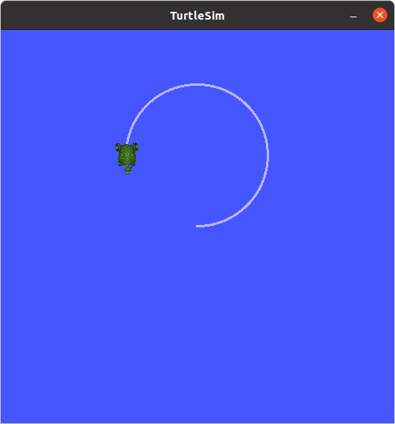

### rclpy Params Tutorial – Get and Set ROS2 Params with Python

코드를 작성할 때, 함수를 ROS 노드라고 하면, 파라미터( `parameter` )는 전역변수라고 할 수 있다. ROS 네트워크에 존재하는 모든 노드에서 접근하여 값을 읽거나 변경할 수 있으며 ROS에서 제공되는 `Parameter Server`에 의해 자동으로 관리된다. 이 튜토리얼에서는 `rclpy` 를 사용한 기본적인 `parameter` 사용법을 다룬다. 

`ros2` 패키지 `param_tutorial` 생성을 위해 작업 경로를 `~/robot_ws/src`로 변경한다. 

```bash
cd ~robot_ws/src
```

다음 명령으로 `rclpy`, `std_msgs` `geometry_msgs`에 의존성을 갖는 ROS2 패키지 `param_tutorial`을 생성한다. 


```bash
ros2 pkg create param_tutorial --build-type ament_python --dependencies rclpy std_msgs geometry_msgs
```


작업 경로를 `~/robot_ws/src/param_tutorial/param_tutorial` 로 변경한다.

```bash
cd ~/robot_ws/src/param_tutorial/param_tutorial
```


노드를 작성할 `script`를 만들고 작업경로를 만들어진 `script`폴더로 변경한다. 


```bash
mkdir script && cd script
```

 

`parameter` `go_turtle`의 값에 따라 `turtlesim` 노드의 거북이를 제어하는 `turtle_by_param.py를 작성한다. 


```bash
gedit turtle_by_param.py
```


```python
import rclpy, sys
from rclpy.node import Node
from rclpy.qos import QoSProfile

from geometry_msgs.msg import Twist
from rclpy.exceptions import ParameterNotDeclaredException
from rcl_interfaces.msg import ParameterType

class ByParam(Node):
    def __init__(self):
        super().__init__('move_by_param')
        qos_profile = QoSProfile(depth=10)
        self.pub = self.create_publisher(Twist, '/turtle1/cmd_vel', qos_profile)
        self.tw = Twist()
        timer_period = 1  # seconds
        self.timer = self.create_timer(timer_period, self.move_turtle)

        self.declare_parameter('go_turtle', 'stop')

    def move_turtle(self):
        param = self.get_parameter('go_turtle').get_parameter_value().string_value
        if param =='go':
            self.tw.linear.x = 0.5
            self.tw.angular.z  = 0.25
        elif param =='stop':
            self.tw.linear.x = 0.0
            self.tw.angular.z  = 0.0
        else:
            pass
        self.pub.publish(self.tw)

        self.get_logger().info('turtle %s!' % param)
        """
        
        self.set_parameters([rclpy.parameter.Parameter(
                        'go_turtle',
                        rclpy.Parameter.Type.STRING,
                        'go'
                    )])
        """

def main():
    rclpy.init()
    node = ByParam()
    node.move_turtle()
   
    rclpy.spin(node)

if __name__ == '__main__':
    main()
```


`setup.py`편집을 위해 작업 경로를 `~/robot_ws/src/param_tutorial`로 변경한다. 


```bash
cd ~/robot_ws/src/param_tutorial
```


`setup.py`를 아래와 같이편집 후, 저장한다. 


```python
from setuptools import find_packages
from setuptools import setup

package_name = 'param_tutorial'

setup(
    name=package_name,
    version='0.0.0',
    packages=[package_name],
    data_files=[
        ('share/ament_index/resource_index/packages',
            ['resource/' + package_name]),
        ('share/' + package_name, ['package.xml']),
    ],
    install_requires=['setuptools'],
    zip_safe=True,
    maintainer='gnd0',
    maintainer_email='greattoe@gmail.com',
    description='TODO: Package description',
    license='TODO: License declaration',
    tests_require=['pytest'],
    entry_points={
        'console_scripts': [
                'turtle_by_param = param_tutorial.script.turtle_by_param:main',
        ],
    },
)
```


빌드를 위해 작업 경로를 `~/robot_ws`로 변경한다. 


```bash
cd ~/robot_ws
```


다음 명령을 수행하여 `para_tutorial` 패키지를 빌드한다. 


```bash
colcon build --symlink-install --packages-select param_tutorial
```


새로 빌드한 패키지( `param_tutorial` ) 정보 반영을 위해 다음 명령을 실행한다. 


```bash
. install/local_setup.bash
```


`turtlesim` 노드 실행을 위해 다음 명령을 실행한다. 

```bash
ros2 run turtlesim turtlesim_node
```


앞서 작성한 노드 `turtle_by_param` 노드 실행을 위해 다음 명령을 실행한다. 

```bash
ros2 run param_tutorial turtle_by_paramgnd0@a10sc:~/robot_ws$ ros2 run param_tutorial turtle_by_param 
[INFO]: turtle stop!
[INFO]: turtle stop!
[INFO]: turtle stop!
[INFO]: turtle stop!
```


새 터미널 창에서 `ros2 param list` 명령을 실행한다. 

```
ros2 param list
/move_by_param:
  go_turtle
  use_sim_time
/turtlesim:
  background_b
  background_g
  background_r
  use_sim_time
```


`ros2 param list` 명령의 실행 결과 화면에서 `move_by_param` 노드는 파라미터 `go_turtle` 과 `use_sim_time` 을, `turtlesim` 노드는 파라미터 `background_b`, `background_b`, `background_b`,`use_sim_time` 을 가지고 있다는 것을 알 수 있다. 

다음 명령으로 `move_by_param` 노드의 파라미터 `go_turtle`의 값을 알아보자.

```
ros2 param get /move_by_param go_turtle 
String value is: stop
```


문자열`stop`이라는 것을 알 수 있다. 또 다른 터니널 창을 렬어 다음 명령으로 파라미터 `go_turtle`의 값을 문자열 `go`로 변경해보자.

```
os2 param set /move_by_param go_turtle go
Set parameter successful
```


앞서 `turtle_by_param` 노드 실행창의 출력이 다음과 같이 바뀐 것을 확인할 수 있다.

```
ros2 run param_tutorial turtle_by_param 
[INFO]: turtle stop!
[INFO]: turtle stop!
[INFO]: turtle stop!
[INFO]: turtle stop!
[INFO]: turtle stop!
[INFO]: turtle go!
[INFO]: turtle go!
[INFO]: turtle go!
[INFO]: turtle go!
[INFO]: turtle go!
[INFO]: turtle go!
```

동시에 `turtlesim`노드의 거북이가 움직이기 시작한 것도 확인할 수 있다.




#### /opt/ros/foxy/share/rcl_interfaces/srv/SetParameters.srv

```python
# A list of parameters to set.
Parameter[] parameters

---
# Indicates whether setting each parameter succeeded or not and why.
SetParametersResult[] results
```


```python
import rclpy, sys
from rclpy.node import Node
from rclpy.qos import QoSProfile
from std_msgs.msg import String
from rcl_interfaces.srv import SetParameters, GetParameters, ListParameters
from rclpy.exceptions import ParameterNotDeclaredException
from rclpy.parameter import Parameter
#from rcl_interfaces.msg import Parameter, ParameterType

SVC_MSG = (sys.argv[1])

class ReqSetParam(Node):
    def __init__(self):
        super().__init__('req_set_param')
        qos_profile = QoSProfile(depth=10)
        self.cli = self.create_client(SetParameters, 'move_by_param/set_parameters')
        while not self.cli.wait_for_service(timeout_sec=1.0):
            self.get_logger().info('service not available, waiting again...')
        self.req = SetParameters.Request()
    def send_request(self):
        self.req.parameters = [Parameter(name='go_turtle', value=SVC_MSG).to_parameter_msg()]
        self.future = self.cli.call_async(self.req)


def main(args=None):
    rclpy.init(args=args)

    client = ReqSetParam()
    client.send_request()

    while rclpy.ok():
        rclpy.spin_once(client)
        if client.future.done():
            try:
                response = client.future.result()
                print(response)
            except Exception as e:
                client.get_logger().info(
                    'Service call failed %r' % (e,))
            break

    client.destroy_node()
    rclpy.shutdown()


if __name__ == '__main__':
    main()
```


#### /opt/ros/foxy/share/rcl_interfaces/srv/GetParameters.srv

```python
# TODO(wjwwood): Decide on the rules for grouping, nodes, and parameter "names"
# in general, then link to that.
#
# For more information about parameters and naming rules, see:
# https://design.ros2.org/articles/ros_parameters.html
# https://github.com/ros2/design/pull/241

# A list of parameter names to get.
string[] names

---
# List of values which is the same length and order as the provided names. If a
# parameter was not yet set, the value will have PARAMETER_NOT_SET as the
# type.
ParameterValue[] values
```


```python
# These types correspond to the value that is set in the ParameterValue message.

# Default value, which implies this is not a valid parameter.
uint8 PARAMETER_NOT_SET=0

uint8 PARAMETER_BOOL=1
uint8 PARAMETER_INTEGER=2
uint8 PARAMETER_DOUBLE=3
uint8 PARAMETER_STRING=4
uint8 PARAMETER_BYTE_ARRAY=5
uint8 PARAMETER_BOOL_ARRAY=6
uint8 PARAMETER_INTEGER_ARRAY=7
uint8 PARAMETER_DOUBLE_ARRAY=8
uint8 PARAMETER_STRING_ARRAY=9
```

