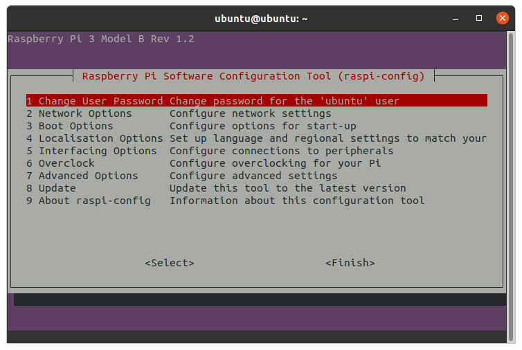
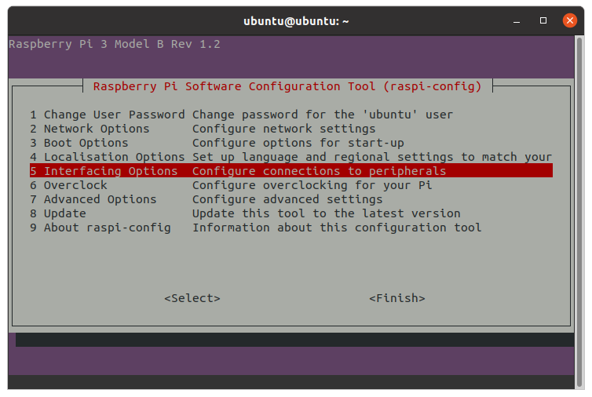
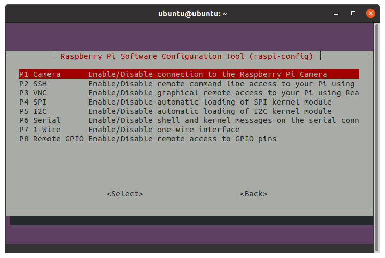
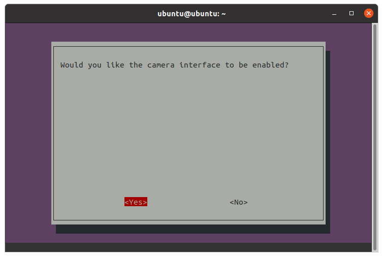
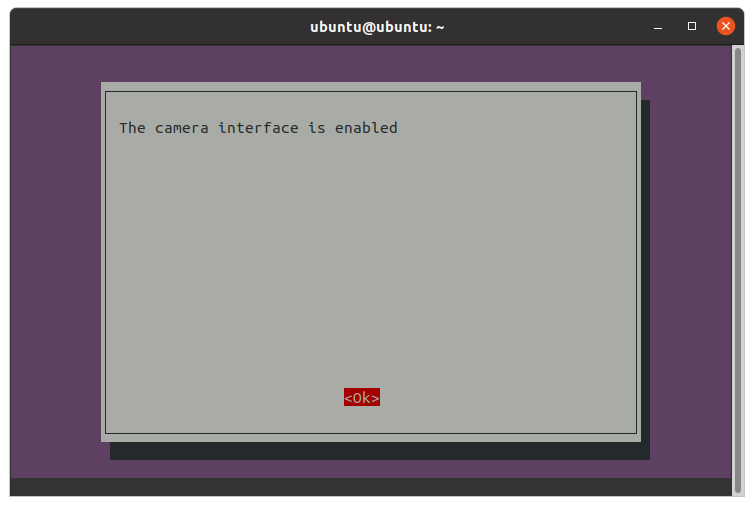
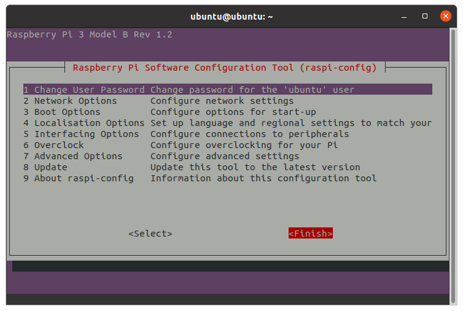
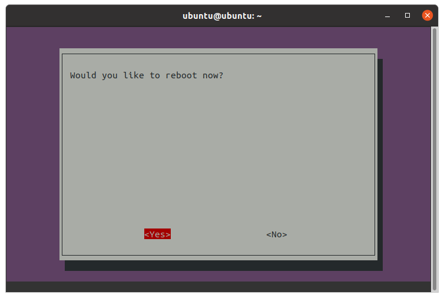
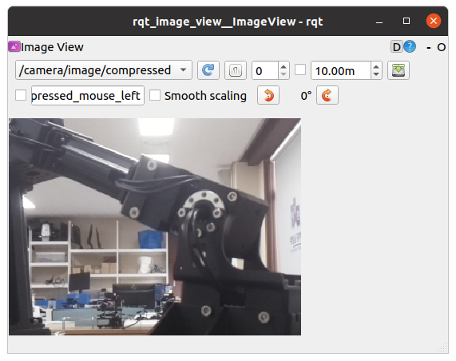

### raspicam2_node 설치

참조1

<https://github.com/christianrauch/raspicam2_node>

참조2

<https://www.codetd.com/en/article/12943496>

작업환경

RaspberryPi 3

Ubuntu 20.04 Server

Raspberrypi Camera Module V2


라즈베리파이 카메라를 위한 ROS2 Node 인 `raspicam2_node`는 라즈베리파이 카메라 모듈 version1, 2 모두 사용할 수 있다. 우선 터틀봇3의 라즈베리파이에 라즈베리파이 전용 카메라 모듈을 CSI 컨넥터에 연결 후 `ssh` 프로토콜로 원격 접속한다. 라즈베리파이의 ip주소가 10.42.0.127라면 터미널 창에 다음과 같이 입력한다. 

```
ssh ubuntu@10.42.0.127
```

계속 원격 접속을 진행하기를 원하냐는 다음 메세지가 나타나면 `yes`를 입력한다.

```
ECDSA key fingerprint is SHA256:wi56fC/B4p4AqtcTE8UjwLLJi9VBKS29wLA2RzVmG94.
Are you sure you want to continue connecting (yes/no/[fingerprint])? yes
```


곧이어 `password`입력을 요구하는 아래 메세지가 나타나면 `turtlebot`을 입력한다. 

```
Warning: Permanently added '10.42.0.127' (ECDSA) to the list of known hosts.
Connection closed by 10.42.0.127 port 22
gnd0@a10sc:~$ ssh ubuntu@10.42.0.127
ubuntu@10.42.0.127's password:
```

아래와 같이 라즈베리파이에 `ubuntu`계정으로 로그인된다.


```
Last login: Fri Nov 11 16:15:55 2022 from 10.42.0.1
ubuntu@ubuntu:~$
```

라즈베리파이의 `Video-Core2` 라이브러리 저장소 등록

```
sudo add-apt-repository ppa:ubuntu-pi-flavour-makers/ppa
```

저장소 등록을 진행하려면 `ENTER` 를, 취소하려면 `ctrl-c`를 입력하라는 메세지가 나타나면 `ENTER`를 입력한다. 

```
Press [ENTER] to continue or Ctrl-c to cancel adding it.
```


라즈베리파이의 `Video-Core` 라이브러리 설치

```
sudo apt install libraspberrypi-bin libraspberrypi-dev
```

`turtlebo3_ws/src`폴더로 작업경로 변경

```
cd ~/turtlebot3_ws/src/
```

`raspicam2_node` 소스코드 가져오기

```
git clone https://github.com/christianrauch/raspicam2_node.git
```

빌드를 위해 작업경로 변경

```
cd ~/turtlebot3_ws/
```

빌드

```
colcon build
```

빌드 정보 반영

```
. install/local_setup.bash
```

`raspicam2_node`실행

```
ros2 run raspicam2 raspicam2_node --ros-args --params-file `ros2 pkg prefix raspicam2`/share/raspicam2/cfg/params.yaml
```

다음 에러가 발생했다면 `raspi-config`를 설치하고, 이를 이용하여 카메라 인터페이스를 활성화 시켜야 한다.

```
* failed to open vchiq instance
```


비디오 장치 확인


`/dev/video0`가 있는 지 확인을 위해 `ls/dev/vid*` 을 수행한다. 

```
ls /dev/vid*/dev/video10  /dev/video12  /dev/video14  /dev/video16
/dev/video11  /dev/video13  /dev/video15
```

`/dev/video0`가 없다. 

`/dev/video0`가 나타나도록 하기 위해 우선 `raspi-config`를 설치한다. 

다음 명령을 수행하여 설치파일( `raspi-config_20200817_all.deb` )을 가져온다.

```
wget http://archive.raspberrypi.org/debian/pool/main/r/raspi-config/raspi-config_20200817_all.deb
```

가져온 설치파일( `raspi-config_20200817_all.deb` )을 아래와 같이 `dpkg` 명령을 이용하여 설치한다. 

```
sudo dpkg -i raspi-config_20200817_all.deb
```


```
sudo apt --fix-broken install
```

`raspi-config`를 실행하여 보자.

```
sudo raspi-config
```




`tap` 키를 이용하여 `<Finish>`를 선택하여 `raspi-config`를 종료한다. 

이제 `raspi-config`를 이용하여 라즈베리파이의 카메라 인터페이스를 활성화 시켜야 한다. 그 전에 `/dev/mmcblk0p1` 폴더가 어느 위치에 `mount`되어 있는 지 확인하기 위해 `df -h`명령을 실행한다.

```
df -hFilesystem      Size  Used Avail Use% Mounted on
udev            407M     0  407M   0% /dev
tmpfs            91M  3.9M   87M   5% /run
/dev/mmcblk0p2   15G  5.5G  8.3G  40% /
tmpfs           455M     0  455M   0% /dev/shm
tmpfs           5.0M     0  5.0M   0% /run/lock
tmpfs           455M     0  455M   0% /sys/fs/cgroup
/dev/loop1       49M   49M     0 100% /snap/core18/2073
/dev/loop4       60M   60M     0 100% /snap/lxd/20330
/dev/mmcblk0p1  253M   60M  193M  24% /boot/firmware
tmpfs            91M     0   91M   0% /run/user/1000
/dev/loop6       42M   42M     0 100% /snap/snapd/17339
/dev/loop7       50M   50M     0 100% /snap/core18/2622
/dev/loop0       60M   60M     0 100% /snap/core20/1699
/dev/loop3       62M   62M     0 100% /snap/lxd/22761
```

실행 결과 `/boot/firmware`에 `mount`되어 있음을 확인할 수 있다.

`raspi-config`에서 카메라 인터페이스활성화 메뉴가 효력을 가지려면 `/dev/mmcblk0p1` 폴더가 `/boot`에 `mount` 되어 있어야만 한다. 

따라서 우선`/boot/firmware`에 `mount`되어있는  `/dev/mmcblk0p1` 을 `unmount` 시켜야 한다.

```
sudo umount /dev/mmcblk0p1
```

`umount` 명령이 제대로 수행 되었는 지 확인을 위해 다시 `df -h` 명령을 실행한다.

```
df -hFilesystem      Size  Used Avail Use% Mounted on
udev            407M     0  407M   0% /dev
tmpfs            91M  3.9M   87M   5% /run
/dev/mmcblk0p2   15G  5.5G  8.3G  40% /
tmpfs           455M     0  455M   0% /dev/shm
tmpfs           5.0M     0  5.0M   0% /run/lock
tmpfs           455M     0  455M   0% /sys/fs/cgroup
/dev/loop1       49M   49M     0 100% /snap/core18/2073
/dev/loop4       60M   60M     0 100% /snap/lxd/20330
tmpfs            91M     0   91M   0% /run/user/1000
/dev/loop6       42M   42M     0 100% /snap/snapd/17339
/dev/loop7       50M   50M     0 100% /snap/core18/2622
/dev/loop0       60M   60M     0 100% /snap/core20/1699
/dev/loop3       62M   62M     0 100% /snap/lxd/22761
```

`/dev/mmcblk0p1`이 리스트에서 사라진 것으로 보아 제대로 `unmount`되었음을 알 수 있다. 

이제 다시 `/dev/mmcblk0p1`을 `/boot`에 `mount`하기 위해 아래 명령을 실행한다.

```
sudo mount /dev/mmcblk0p1 /boot
```

역시 실행 결과를 확인하기 위해 `df -h` 명령을 실행한다. 

```
df -hFilesystem      Size  Used Avail Use% Mounted on
udev            407M     0  407M   0% /dev
tmpfs            91M  3.9M   87M   5% /run
/dev/mmcblk0p2   15G  5.5G  8.3G  40% /
tmpfs           455M     0  455M   0% /dev/shm
tmpfs           5.0M     0  5.0M   0% /run/lock
tmpfs           455M     0  455M   0% /sys/fs/cgroup
/dev/loop1       49M   49M     0 100% /snap/core18/2073
/dev/loop4       60M   60M     0 100% /snap/lxd/20330
tmpfs            91M     0   91M   0% /run/user/1000
/dev/loop6       42M   42M     0 100% /snap/snapd/17339
/dev/loop7       50M   50M     0 100% /snap/core18/2622
/dev/loop0       60M   60M     0 100% /snap/core20/1699
/dev/loop3       62M   62M     0 100% /snap/lxd/22761
/dev/mmcblk0p1  253M   60M  193M  24% /boot
```

 마지막 줄에서 `/dev/mmcblk0p1`이 `/boot`에 `mount`된 것을 확인할 수 있다. 이제 다시 `raspi-config`를 실행하여 카메라 인터페이스를 활성화 시키고, `/dev/video0` 장치가 나타나는 지 확인해	보자.

```
sudo raspi-config
```

`5. Interfacing Options` 선택



`P1 Camera` 선택



`<Yes>` 선택





`<OK>` 선택




`<Finish>` 선택




`<Yes>` 선택

리부팅이 끝나면 `/dev/video0`가 나타나는 지 확인한다.

```
 ls /dev/vid*
/dev/video0   /dev/video11  /dev/video13  /dev/video15
/dev/video10  /dev/video12  /dev/video14  /dev/video16
```

 `/dev/video0`가 확인되면 다음 명령으로 `raspicam2_node`를 실행한다.

```
ros2 run raspicam2 raspicam2_node --ros-args --params-file `ros2 pkg prefix raspicam2`/share/raspicam2/cfg/params.yaml
```

아래와 같은 메세지가 나타나면 정상적으로 구동된 것이다.

```
Camera component done
Image encoder component done
Video encoder component done
splitter component done
Starting video capture (320, 240, 80, 90)
Video capture started
```

새 터미널 창에서 `ros2 topic list`명령을 실행하여 카메라 관련 토픽들의 발행 상태를 확인한다.

```
ros2 topic list 
/camera/image/camera_info
/camera/image/compressed
/parameter_events
/rosout
```

`/camera/image/camera_info`토픽과 `/camera/image/compressed`토픽을 확인할 수 있다.

`rqt`에서 영상을 확인해보자

```
/camera/image/compressed
```

`image topic`으로 `/camera/image/compressed`를 선택하면 다음과 같은 화면을 볼 수 있을 것이다.



