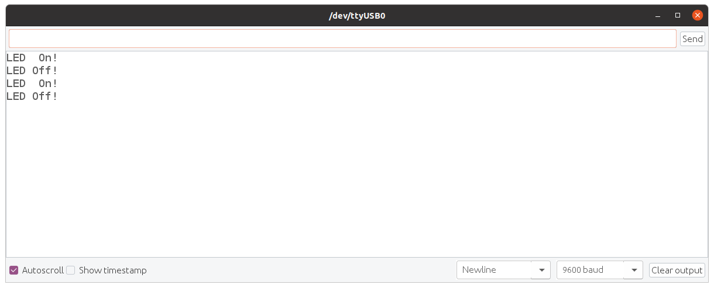

## Turtlebot3 Arduino 제어

작업환경

Turtlebot3 / RaspberryPi 3 

Ubuntu 20.04 Server

터틀봇3에 Actuator나 Sensor를 추가할 경우 가장 쉬운 방법은 `Arduino`를 이용하는 것이다. 하지만 터틀봇3의 `OpenCR`보드에 직접 Sensor 또는 Actuator를 추가할 경우 터틀봇3의 펌웨어를 수정해야만 하는데, 이 펌웨어 코드가 ROS Kinetic의 경우 800줄이 넘어가는 규모이며, `Odometry` 정보는 물론 좌우 바퀴의 구동 제어 및 각종 센서 정보가 유기적으로 맞물려 돌아가는 구조이기 때문에 자칫하면 터틀봇3의 구동 자체에 문제가 발생할 수 있다. 따라서 `Arduino`를 추가로 장착하고 이를 시리얼 통신으로 제어하는 것이 합리적이다. 그 방법을 알아보자.

#### 1. 시리얼 통신을 통한 LED On/Off 아두이노 코드 작성 

아두이노에 다음 코드를 업로드한다. 

```c
const int pinLed = 13;

void setup() {
  pinMode(pinLed,OUTPUT);
  digitalWrite(pinLed,LOW);
  Serial.begin(9600);
}

void loop() {
  if(Serial.available() > 0) {
    unsigned char ch = Serial.read();
    if     (ch == '1') {
    	digitalWrite(pinLed,HIGH);
    	Serial.println("LED  On!");
    }
    else if(ch == '0') {
    	digitalWrite(pinLed,LOW );
    	Serial.println("LED Off!");
    }
    else;
  }
}
```


코드는 간단하다. 시리얼로 '1'을 수신하면 온보드 LED를 켜고, '0'을 수신하면 온보드 LED를 끄고, 그 외의 문자가 수신되면 무시하는 코드이다. `Arduino IDE`의 시리얼 모니터를 이용하여 동작을 테스트 해보자.



### 3. `pyserial` 라이브러리를 이용한 시리얼통신코드 작성

이제 시리얼 통신으로 '1' 또는 '0'을 송신하는 파이썬 코드를 작성해보자. 이 작업에는 `pyserial` 라이브러리가 필요하다.

```
pip3 install pyserial
```

파이썬3를 위한 `pip`가 설치되어 있지 않아 에러가 발생할 경우, 다음 명령으로 설치할 수 있다.

```
sudo apt install python3-pip
```

이제 시리얼 통신으로 '1' 또는 '0'을 송신하는 파이썬 코드를 작성해보자. 일단 현재 아두이노가 연결된 시리얼포트 이름을 알아보자. 아두이노가 연결되지 않은 상태에서 `ls /dev/tty*` 명령을 실행한다.

```
ls /dev/tty*/dev/tty*    /dev/tty23  /dev/tty39  /dev/tty54      /dev/ttyS10  /dev/ttyS26
/dev/tty0   /dev/tty24  /dev/tty4   /dev/tty55      /dev/ttyS11  /dev/ttyS27
/dev/tty1   /dev/tty25  /dev/tty40  /dev/tty56      /dev/ttyS12  /dev/ttyS28
/dev/tty10  /dev/tty26  /dev/tty41  /dev/tty57      /dev/ttyS13  /dev/ttyS29
/dev/tty11  /dev/tty27  /dev/tty42  /dev/tty58      /dev/ttyS14  /dev/ttyS3
/dev/tty12  /dev/tty28  /dev/tty43  /dev/tty59      /dev/ttyS15  /dev/ttyS30
/dev/tty13  /dev/tty29  /dev/tty44  /dev/tty6       /dev/ttyS16  /dev/ttyS31
/dev/tty14  /dev/tty3   /dev/tty45  /dev/tty60      /dev/ttyS17  /dev/ttyS4
/dev/tty15  /dev/tty30  /dev/tty46  /dev/tty61      /dev/ttyS18  /dev/ttyS5
/dev/tty16  /dev/tty31  /dev/tty47  /dev/tty62      /dev/ttyS19  /dev/ttyS6
/dev/tty17  /dev/tty32  /dev/tty48  /dev/tty63      /dev/ttyS2   /dev/ttyS7
/dev/tty18  /dev/tty33  /dev/tty49  /dev/tty7       /dev/ttyS20  /dev/ttyS8
/dev/tty19  /dev/tty34  /dev/tty5   /dev/tty8       /dev/ttyS21  /dev/ttyS9
/dev/tty2   /dev/tty35  /dev/tty50  /dev/tty9       /dev/ttyS22
/dev/tty20  /dev/tty36  /dev/tty51  /dev/ttyprintk  /dev/ttyS23
/dev/tty21  /dev/tty37  /dev/tty52  /dev/ttyS0      /dev/ttyS24
/dev/tty22  /dev/tty38  /dev/tty53  /dev/ttyS1      /dev/ttyS25
```

이 번에는 아두이노를 연결 후 같은 명령을 실행한다. 

```
ls /dev/tty*
/dev/tty    /dev/tty23  /dev/tty39  /dev/tty54      /dev/ttyS10  /dev/ttyS26
/dev/tty0   /dev/tty24  /dev/tty4   /dev/tty55      /dev/ttyS11  /dev/ttyS27
/dev/tty1   /dev/tty25  /dev/tty40  /dev/tty56      /dev/ttyS12  /dev/ttyS28
/dev/tty10  /dev/tty26  /dev/tty41  /dev/tty57      /dev/ttyS13  /dev/ttyS29
/dev/tty11  /dev/tty27  /dev/tty42  /dev/tty58      /dev/ttyS14  /dev/ttyS3
/dev/tty12  /dev/tty28  /dev/tty43  /dev/tty59      /dev/ttyS15  /dev/ttyS30
/dev/tty13  /dev/tty29  /dev/tty44  /dev/tty6       /dev/ttyS16  /dev/ttyS31
/dev/tty14  /dev/tty3   /dev/tty45  /dev/tty60      /dev/ttyS17  /dev/ttyS4
/dev/tty15  /dev/tty30  /dev/tty46  /dev/tty61      /dev/ttyS18  /dev/ttyS5
/dev/tty16  /dev/tty31  /dev/tty47  /dev/tty62      /dev/ttyS19  /dev/ttyS6
/dev/tty17  /dev/tty32  /dev/tty48  /dev/tty63      /dev/ttyS2   /dev/ttyS7
/dev/tty18  /dev/tty33  /dev/tty49  /dev/tty7       /dev/ttyS20  /dev/ttyS8
/dev/tty19  /dev/tty34  /dev/tty5   /dev/tty8       /dev/ttyS21  /dev/ttyS9
/dev/tty2   /dev/tty35  /dev/tty50  /dev/tty9       /dev/ttyS22  /dev/ttyUSB0
/dev/tty20  /dev/tty36  /dev/tty51  /dev/ttyprintk  /dev/ttyS23
/dev/tty21  /dev/tty37  /dev/tty52  /dev/ttyS0      /dev/ttyS24
/dev/tty22  /dev/tty38  /dev/tty53  /dev/ttyS1      /dev/ttyS25
```

`/dev/ttyUSB0`가 나타난 것을 확인할 수 있다. (아두이노 보드에 따라 `/dev/ttyACM0` 가 나타날 수도 있다. )

이제 다음 코드를 작성 하여 `led_ctrl.py`로 저장한다.

```
gedit led_ctrl.py
```

```python
from select import select
import serial
import os, time, sys, termios, atexit, tty

class GetChar:
    def __init__(self):
        # Save the terminal settings
        self.fd = sys.stdin.fileno()
        self.new_term = termios.tcgetattr(self.fd)
        self.old_term = termios.tcgetattr(self.fd)
  
        # New terminal setting unbuffered
        self.new_term[3] = (self.new_term[3] & ~termios.ICANON & ~termios.ECHO)
        termios.tcsetattr(self.fd, termios.TCSAFLUSH, self.new_term)
  
        # Support normal-terminal reset at exit
        atexit.register(self.set_normal_term)      
      
    def set_normal_term(self):
        termios.tcsetattr(self.fd, termios.TCSAFLUSH, self.old_term)
  
    def getch(self):        # get 1 byte from stdin
        """ Returns a keyboard character after getch() has been called """
        return sys.stdin.read(1)
  
    def chk_stdin(self):    # check keyboard input
        """ Returns True if keyboard character was hit, False otherwise. """
        dr, dw, de = select([sys.stdin], [], [], 0)
        return dr


if __name__ == '__main__':

    try:
        sp  = serial.Serial('/dev/ttyUSB0', 9600, timeout=1)
        kb  = GetChar()
        dat = ""
        print("type '1' for turn on led, type'0' for turn off led...")
        
        while True:
            
            ch = kb.getch()
            
            if   ch == '1':
                sp.write(b'1') 
                print("led  on")
                
            elif ch == '0':
                sp.write(b'0') 
                print("led off")              
                
            
            else:
                pass
            
    except KeyboardInterrupt:
```

작성한 코드를 저장 후, 실행하여 동작을 확인한다. (아두이노 시리얼 모니터가 실행 중이라면 반드시 종료 후 실행하자. )

```bash
python3 ledpython3 led_ctrl.py 
type '1' for turn on led, type'0' for turn off led...
led  on
led off
led  on
led off
```


### 4. 아두이노 제어 패키지 생성

아두이노 led 동작상태가 확인되었으면 아두이노 LED를 제어하는 ROS2 노드패키지 `arduino`를 만들기 위해 작업 경로를 `~/robot_ws/src` 로 변경한다.

```
cd ~/robot_ws/src
```

`rclpy`와 `std_msgs`에 의존성을 가지는 패키지 `arduino`를 만든다.

```
ros2 pkg create arduino --build-type ament_python --dependencies rclpy std_msgs
```


다음 명령으로 생성된 중첩된 패키지 폴더로 작업경로를 변경한다.

```
cd ~/robot_ws/src/arduino/arduino
```

`ls` 명령으로 작업경로에 `__init__.py`파일의 존재를 확인한다.

```
ls__init__.py
__init__.py
```

이 위치에 키보드로 부터 한 문자를 입력 받기위한   `getchar.py`를 작성한다. (이 코드는 ROS2 노드는 아니다. 키보드 입력을 받기위해 `import`하여 사용하기 위한 일종의 사용자 라이브러리이다.)

```
gedit getchar.py &
```


```python
import os, time, sys, termios, atexit, tty
from select import select
  
# class for checking keyboard input
class Getchar:
    def __init__(self):
        # Save the terminal settings
        self.fd = sys.stdin.fileno()
        self.new_term = termios.tcgetattr(self.fd)
        self.old_term = termios.tcgetattr(self.fd)
  
        # New terminal setting unbuffered
        self.new_term[3] = (self.new_term[3] & ~termios.ICANON & ~termios.ECHO)
        termios.tcsetattr(self.fd, termios.TCSAFLUSH, self.new_term)
  
        # Support normal-terminal reset at exit
        atexit.register(self.set_normal_term)      
      
    def set_normal_term(self):
        termios.tcsetattr(self.fd, termios.TCSAFLUSH, self.old_term)
  
    def getch(self):        # get 1 byte from stdin
        """ Returns a keyboard character after getch() has been called """
        return sys.stdin.read(1)
  
    def chk_stdin(self):    # check keyboard input
        """ Returns True if keyboard character was hit, False otherwise. """
        dr, dw, de = select([sys.stdin], [], [], 0)
        return dr
```


작성한 `getchar.py`코드를 저장 후, 이 후 작성할  `pub_led_msg.py` 노드와 `sub_led_msg.py` 노드를 저장할 `script` 폴더를 만들고 작업 경로를 해당 폴더로 변경한다. 

```
mkdir script && cd script
```

LED 제어토픽 `led_msg`발행 노드 `pub_led_msg` 작성

```
gedit pub_led_msg &
```


```python
import rclpy
from rclpy.node import Node

from std_msgs.msg import String
from arduino.getchar import Getchar

class PubLED_MSG(Node):

    def __init__(self):
        super().__init__('pub_led_msg')
        self.pub_led = self.create_publisher(String, 'led_msg', 10)
        self.led_msg = String()
        
    def pub_led_msg(self, led_msg):
        msg = String()
        msg.data = led_msg
        self.pub_led.publish(msg)

def main(args=None):
    rclpy.init(args=args)

    node = PubLED_MSG()

    #rclpy.spin(node)
    try:
        kb = Getchar()
        key =''
        while rclpy.ok():
            key = kb.getch()
            if key == '1':
                node.pub_led_msg('on')
            elif key == '0':
                node.pub_led_msg('off')
            else:
                pass
    except KeyboardInterrupt:
    # Destroy the node explicitly
    # (optional - otherwise it will be done automatically
    # when the garbage collector destroys the node object)
    
            node.destroy_node()
            rclpy.shutdown()


if __name__ == '__main__':
    main()
```


이노드는 키보드 `1` 키가 입력되면 문자열`"on"`을, `0` 키가 입력되면 문자열 `"off"`를 그 내용으로 하는 토픽 `led_msg`를 발행하는 일종의 `publisher` 노드이다. 작성한 코드를 저장 후, 

`setup.py`를 수정하기 위해 작업 경로를 `~/robot_ws/arduino`로 변경한다.

```
cd ~/robot_ws/src/arduino
```


`setup.py`파일을 편집한다. 

```

gedit setup.py &
```

```python
from setuptools import setup

package_name = 'arduino'
setup(
    name=package_name,
    version='0.0.0',
    packages=[package_name],
    data_files=[
        ('share/ament_index/resource_index/packages',
            ['resource/' + package_name]),
        ('share/' + package_name, ['package.xml']),
    ],
    install_requires=['setuptools'],
    zip_safe=True,
    maintainer='gnd0',
    maintainer_email='greattoe@gmail.com',
    description='TODO: Package description',
    license='TODO: License declaration',
    tests_require=['pytest'],
    entry_points={
        'console_scripts': [
                'pub_led_msg   = arduino.script.pub_led_msg:main',
        ],
    },
)
```

위 내용 아래 `'console_scripts'` 필드의 대괄호 안에 다음과 같이 한 줄을 추가한다. 

```python
entry_points={
        'console_scripts': [
                'pub_led_msg   = arduino.script.pub_led_msg:main',
        ],
},
```

패키지 빌드를 위해 작업 경로를 `robot_ws`로 변경한다.

```
cd ~/robot_ws/
```

다음 명령으로 빌드한다.

```
colcon build --symlink-install
```

새로 빌드된 패키지 정보 반영을 위해 다음 명령을 실행한다. 

```
. install/local_setup.bash
```

### 5. `pub_led_msg.py` 노드 테스트

`pub_led_msg` 노드의 동작 테스트를 위해 해당노드를 실행한다. 

```
ros2 run arduino pub_led_msg
```

새 터미널 창을 열고 `ros2 topic list` 명령을 실행하여 `/led_msg` 토픽이 리스트에 존재하는 지 확인한다. 

```
ros2 topic list 
/led_msg
/parameter_events
/rosout
```

토픽 리스트에서 해당 토픽이 확인 되었다면 다음 명령을 실행하여 해당 토픽을 화면에 `echo` 시킨다.

```
ros2 topic echo /led_msg
```

아직은 아무 변화가 없지만 앞서 `pub_led_msg`노드를 실행한 터미널 창에서 `1`키와 `0`키를 입력해 주면 다음과 같은 출력이 화면에 나타난다. 

```
ros2 topic echo /led_msg 
data: 'on'
---
data: 'off'
---
data: 'on'
---
data: 'off'
---
data: 'on'
---
data: 'off'
```

#### 6. `sub_led_msg.py`노드 작성

이제 `led_msg` 토픽을 구독하여  `led_msg` 토픽의 내용에 따라 시리얼로 '1' 또는 '0'을 전송하여 아두이노의 LED를 제어하는 `led_msg`토픽 서브스크라이버 노드 `sub_led_msg.py`를 작성하기 위해 작업 경로를 `~/robot_ws/src/srduino/srduino/script`로 변경한다.

```
cd robot_ws/src/srduino/srduino/script
```

`sub_led_msg.py` 작성

```
gedit sub_led_msg.py &
```


```python
import rclpy, sys, serial
from rclpy.node import Node
from rclpy.qos import QoSProfile

from std_msgs.msg import String


sp  = serial.Serial('/dev/ttyUSB0', 9600, timeout=1)
class SubLED_MSG(Node):

    def __init__(self):
        super().__init__('sub_led_msg')
        qos_profile = QoSProfile(depth=10)
        self.subscription = self.create_subscription(
            String, '/led_msg', self.get_led_msg, qos_profile )
        self.led_msg = String()
        

                    
    def get_led_msg(self, msg):
        self.led_msg = msg.data
        
        if self.led_msg == "on":
            sp.write(b'1')
            print("1")
        elif self.led_msg == "off":
            sp.write(b'0')
            print("0")
        
        print(self.led_msg)

def main(args=None):
    rclpy.init(args=args)
    node = SubLED_MSG()
    try:    
        #while rclpy.ok():
            #pass
        #sys.exit(1)
        rclpy.spin(node)
    except KeyboardInterrupt:
    
    # Destroy the node explicitly
    # (optional - otherwise it will be done automatically
    # when the garbage collector destroys the node object)
    
            node.destroy_node()
            rclpy.shutdown()


if __name__ == '__main__':
    main()
```


`setup.py` 수정을 위해 작업경로 변경

```
cd ~/robot_ws/src/arduino
```

`setup.py` 수정


`setup.py`파일을 편집한다. 

```
gedit setup.py &
```

```python
from setuptools import setup

package_name = 'arduino'
setup(
    name=package_name,
    version='0.0.0',
    packages=[package_name],
    data_files=[
        ('share/ament_index/resource_index/packages',
            ['resource/' + package_name]),
        ('share/' + package_name, ['package.xml']),
    ],
    install_requires=['setuptools'],
    zip_safe=True,
    maintainer='gnd0',
    maintainer_email='greattoe@gmail.com',
    description='TODO: Package description',
    license='TODO: License declaration',
    tests_require=['pytest'],
    entry_points={
        'console_scripts': [
        ],
    },
)
```

위 내용 아래 `'console_scripts'` 필드의 대괄호 안에 다음과 같이 한 줄을 추가한다. 

```python
entry_points={
        'console_scripts': [
                'sub_led_msg   = arduino.script.sub_led_msg:main',
        ],
},
```

패키지 빌드를 위해 작업 경로를 `turtlebot3_ws`로 변경한다.

```
cd ~/turtlebot3_ws/
```

다음 명령으로 빌드한다.

```
colcon build --symlink-install
```

새로 빌드된 패키지 정보 반영을 위해 다음 명령을 실행한다. 

```
. install/local_setup.bash
```


### 7. `pub_led_msg.py & `sub_led_msg.py 연동 테스트

새 터미널 창에서 `pub_led_msg.py` 노드를 실행한다.

```
ros2 run arduino pub_led_msg
```

또 다른 터미널 창에서 `sub_led_msg.py` 노드를 실행한다.

`sub_led_msg.py` 노드 실행

```
ros2 run arduino sub_led_msg
```

`pub_led_msg.py`노드를 실행한 창에서 `1`키와 `0`키를 입력했을 때 `sub_led_msg.py` 노드를 실행한 터미널 창의 변화와 아두이노 온보드 LED의 점등 상태를 확인한다.

```
ros2 run arduino sub_led_msg 
01
on
0
off
1
on
0
off
1
on
0
off
1
on
0
off
```


### 8. 터틀봇3 라즈베리파이에서의 작업

라즈베리파이의 `/etc/netplan/50-cloud-init.yaml`의 내용이 노트북에서 구동한 핫스팟에 연결되도록 적절히 설정되어 있음을 전제로, 라즈베리 파이의 ip주소를 알아내기 위해 다음 명령을 수행한다. 

```
nmap -sn 10.42.0.0/24
Starting Nmap 7.80 ( https://nmap.org ) at 2022-11-15 23:42 KST
Nmap scan report for a10sc (10.42.0.1)
Host is up (0.00025s latency).
Nmap scan report for 10.42.0.25
Host is up (0.021s latency).
Nmap done: 256 IP addresses (2 hosts up) scanned in 16.89 seconds
```

라즈베리파이의 ip주소가 10.42.0.25임을 알 수 있다. `ssh`를 이용해 라즈베리파이에 원격 접속한다.

```
ssh ubuntu@10.42.0.25
ubuntu@10.42.0.25's password: 
```

패스워드 `turtlebot`을 입력한다.

시리얼 포트를 알아내기 위해 `ls /dev/tty*` 명령을 실행한다.

```
ls /dev/tty*
/dev/tty    /dev/tty58    /dev/ttycc      /dev/ttyq2  /dev/ttyt8    /dev/ttywe
/dev/tty0   /dev/tty59    /dev/ttycd      /dev/ttyq3  /dev/ttyt9    /dev/ttywf
/dev/tty1   /dev/tty6     /dev/ttyce      /dev/ttyq4  /dev/ttyta    /dev/ttyx0
/dev/tty10  /dev/tty60    /dev/ttycf      /dev/ttyq5  /dev/ttytb    /dev/ttyx1
/dev/tty11  /dev/tty61    /dev/ttyd0      /dev/ttyq6  /dev/ttytc    /dev/ttyx2
/dev/tty12  /dev/tty62    /dev/ttyd1      /dev/ttyq7  /dev/ttytd    /dev/ttyx3
/dev/tty13  /dev/tty63    /dev/ttyd2      /dev/ttyq8  /dev/ttyte    /dev/ttyx4
/dev/tty14  /dev/tty7     /dev/ttyd3      /dev/ttyq9  /dev/ttytf    /dev/ttyx5
/dev/tty15  /dev/tty8     /dev/ttyd4      /dev/ttyqa  /dev/ttyu0    /dev/ttyx6
/dev/tty16  /dev/tty9     /dev/ttyd5      /dev/ttyqb  /dev/ttyu1    /dev/ttyx7
/dev/tty17  /dev/ttya0    /dev/ttyd6      /dev/ttyqc  /dev/ttyu2    /dev/ttyx8
/dev/tty18  /dev/ttya1    /dev/ttyd7      /dev/ttyqd  /dev/ttyu3    /dev/ttyx9
/dev/tty19  /dev/ttya2    /dev/ttyd8      /dev/ttyqe  /dev/ttyu4    /dev/ttyxa
/dev/tty2   /dev/ttya3    /dev/ttyd9      /dev/ttyqf  /dev/ttyu5    /dev/ttyxb
/dev/tty20  /dev/ttya4    /dev/ttyda      /dev/ttyr0  /dev/ttyu6    /dev/ttyxc
/dev/tty21  /dev/ttya5    /dev/ttydb      /dev/ttyr1  /dev/ttyu7    /dev/ttyxd
/dev/tty22  /dev/ttya6    /dev/ttydc      /dev/ttyr2  /dev/ttyu8    /dev/ttyxe
/dev/tty23  /dev/ttya7    /dev/ttydd      /dev/ttyr3  /dev/ttyu9    /dev/ttyxf
/dev/tty24  /dev/ttya8    /dev/ttyde      /dev/ttyr4  /dev/ttyua    /dev/ttyy0
/dev/tty25  /dev/ttya9    /dev/ttydf      /dev/ttyr5  /dev/ttyub    /dev/ttyy1
/dev/tty26  /dev/ttyaa    /dev/ttye0      /dev/ttyr6  /dev/ttyuc    /dev/ttyy2
/dev/tty27  /dev/ttyab    /dev/ttye1      /dev/ttyr7  /dev/ttyud    /dev/ttyy3
/dev/tty28  /dev/ttyac    /dev/ttye2      /dev/ttyr8  /dev/ttyue    /dev/ttyy4
/dev/tty29  /dev/ttyad    /dev/ttye3      /dev/ttyr9  /dev/ttyuf    /dev/ttyy5
/dev/tty3   /dev/ttyae    /dev/ttye4      /dev/ttyra  /dev/ttyUSB0  /dev/ttyy6
/dev/tty30  /dev/ttyaf    /dev/ttye5      /dev/ttyrb  /dev/ttyv0    /dev/ttyy7
/dev/tty31  /dev/ttyAMA0  /dev/ttye6      /dev/ttyrc  /dev/ttyv1    /dev/ttyy8
/dev/tty32  /dev/ttyb0    /dev/ttye7      /dev/ttyrd  /dev/ttyv2    /dev/ttyy9
/dev/tty33  /dev/ttyb1    /dev/ttye8      /dev/ttyre  /dev/ttyv3    /dev/ttyya
/dev/tty34  /dev/ttyb2    /dev/ttye9      /dev/ttyrf  /dev/ttyv4    /dev/ttyyb
/dev/tty35  /dev/ttyb3    /dev/ttyea      /dev/ttys0  /dev/ttyv5    /dev/ttyyc
/dev/tty36  /dev/ttyb4    /dev/ttyeb      /dev/ttyS0  /dev/ttyv6    /dev/ttyyd
/dev/tty37  /dev/ttyb5    /dev/ttyec      /dev/ttys1  /dev/ttyv7    /dev/ttyye
/dev/tty38  /dev/ttyb6    /dev/ttyed      /dev/ttys2  /dev/ttyv8    /dev/ttyyf
/dev/tty39  /dev/ttyb7    /dev/ttyee      /dev/ttys3  /dev/ttyv9    /dev/ttyz0
/dev/tty4   /dev/ttyb8    /dev/ttyef      /dev/ttys4  /dev/ttyva    /dev/ttyz1
/dev/tty40  /dev/ttyb9    /dev/ttyp0      /dev/ttys5  /dev/ttyvb    /dev/ttyz2
/dev/tty41  /dev/ttyba    /dev/ttyp1      /dev/ttys6  /dev/ttyvc    /dev/ttyz3
/dev/tty42  /dev/ttybb    /dev/ttyp2      /dev/ttys7  /dev/ttyvd    /dev/ttyz4
/dev/tty43  /dev/ttybc    /dev/ttyp3      /dev/ttys8  /dev/ttyve    /dev/ttyz5
/dev/tty44  /dev/ttybd    /dev/ttyp4      /dev/ttys9  /dev/ttyvf    /dev/ttyz6
/dev/tty45  /dev/ttybe    /dev/ttyp5      /dev/ttysa  /dev/ttyw0    /dev/ttyz7
/dev/tty46  /dev/ttybf    /dev/ttyp6      /dev/ttysb  /dev/ttyw1    /dev/ttyz8
/dev/tty47  /dev/ttyc0    /dev/ttyp7      /dev/ttysc  /dev/ttyw2    /dev/ttyz9
/dev/tty48  /dev/ttyc1    /dev/ttyp8      /dev/ttysd  /dev/ttyw3    /dev/ttyza
/dev/tty49  /dev/ttyc2    /dev/ttyp9      /dev/ttyse  /dev/ttyw4    /dev/ttyzb
/dev/tty5   /dev/ttyc3    /dev/ttypa      /dev/ttysf  /dev/ttyw5    /dev/ttyzc
/dev/tty50  /dev/ttyc4    /dev/ttypb      /dev/ttyt0  /dev/ttyw6    /dev/ttyzd
/dev/tty51  /dev/ttyc5    /dev/ttypc      /dev/ttyt1  /dev/ttyw7    /dev/ttyze
/dev/tty52  /dev/ttyc6    /dev/ttypd      /dev/ttyt2  /dev/ttyw8    /dev/ttyzf
/dev/tty53  /dev/ttyc7    /dev/ttype      /dev/ttyt3  /dev/ttyw9
/dev/tty54  /dev/ttyc8    /dev/ttypf      /dev/ttyt4  /dev/ttywa
/dev/tty55  /dev/ttyc9    /dev/ttyprintk  /dev/ttyt5  /dev/ttywb
/dev/tty56  /dev/ttyca    /dev/ttyq0      /dev/ttyt6  /dev/ttywc
/dev/tty57  /dev/ttycb    /dev/ttyq1      /dev/ttyt7  /dev/ttywd
```

아두이노를 라즈베리파이의 USB 포트에 연결 후 다시 `ls /dev/tty*` 명령을 실행한다. 

```
ls /dev/tty*
/dev/tty    /dev/tty58    /dev/ttycc      /dev/ttyq2  /dev/ttyt8    /dev/ttywe
/dev/tty0   /dev/tty59    /dev/ttycd      /dev/ttyq3  /dev/ttyt9    /dev/ttywf
/dev/tty1   /dev/tty6     /dev/ttyce      /dev/ttyq4  /dev/ttyta    /dev/ttyx0
/dev/tty10  /dev/tty60    /dev/ttycf      /dev/ttyq5  /dev/ttytb    /dev/ttyx1
/dev/tty11  /dev/tty61    /dev/ttyd0      /dev/ttyq6  /dev/ttytc    /dev/ttyx2
/dev/tty12  /dev/tty62    /dev/ttyd1      /dev/ttyq7  /dev/ttytd    /dev/ttyx3
/dev/tty13  /dev/tty63    /dev/ttyd2      /dev/ttyq8  /dev/ttyte    /dev/ttyx4
/dev/tty14  /dev/tty7     /dev/ttyd3      /dev/ttyq9  /dev/ttytf    /dev/ttyx5
/dev/tty15  /dev/tty8     /dev/ttyd4      /dev/ttyqa  /dev/ttyu0    /dev/ttyx6
/dev/tty16  /dev/tty9     /dev/ttyd5      /dev/ttyqb  /dev/ttyu1    /dev/ttyx7
/dev/tty17  /dev/ttya0    /dev/ttyd6      /dev/ttyqc  /dev/ttyu2    /dev/ttyx8
/dev/tty18  /dev/ttya1    /dev/ttyd7      /dev/ttyqd  /dev/ttyu3    /dev/ttyx9
/dev/tty19  /dev/ttya2    /dev/ttyd8      /dev/ttyqe  /dev/ttyu4    /dev/ttyxa
/dev/tty2   /dev/ttya3    /dev/ttyd9      /dev/ttyqf  /dev/ttyu5    /dev/ttyxb
/dev/tty20  /dev/ttya4    /dev/ttyda      /dev/ttyr0  /dev/ttyu6    /dev/ttyxc
/dev/tty21  /dev/ttya5    /dev/ttydb      /dev/ttyr1  /dev/ttyu7    /dev/ttyxd
/dev/tty22  /dev/ttya6    /dev/ttydc      /dev/ttyr2  /dev/ttyu8    /dev/ttyxe
/dev/tty23  /dev/ttya7    /dev/ttydd      /dev/ttyr3  /dev/ttyu9    /dev/ttyxf
/dev/tty24  /dev/ttya8    /dev/ttyde      /dev/ttyr4  /dev/ttyua    /dev/ttyy0
/dev/tty25  /dev/ttya9    /dev/ttydf      /dev/ttyr5  /dev/ttyub    /dev/ttyy1
/dev/tty26  /dev/ttyaa    /dev/ttye0      /dev/ttyr6  /dev/ttyuc    /dev/ttyy2
/dev/tty27  /dev/ttyab    /dev/ttye1      /dev/ttyr7  /dev/ttyud    /dev/ttyy3
/dev/tty28  /dev/ttyac    /dev/ttye2      /dev/ttyr8  /dev/ttyue    /dev/ttyy4
/dev/tty29  /dev/ttyad    /dev/ttye3      /dev/ttyr9  /dev/ttyuf    /dev/ttyy5
/dev/tty3   /dev/ttyae    /dev/ttye4      /dev/ttyra  /dev/ttyUSB0  /dev/ttyUSB1
/dev/tty30  /dev/ttyaf    /dev/ttye5      /dev/ttyrb  /dev/ttyv0    /dev/ttyy7
/dev/tty31  /dev/ttyAMA0  /dev/ttye6      /dev/ttyrc  /dev/ttyv1    /dev/ttyy8
/dev/tty32  /dev/ttyb0    /dev/ttye7      /dev/ttyrd  /dev/ttyv2    /dev/ttyy9
/dev/tty33  /dev/ttyb1    /dev/ttye8      /dev/ttyre  /dev/ttyv3    /dev/ttyya
/dev/tty34  /dev/ttyb2    /dev/ttye9      /dev/ttyrf  /dev/ttyv4    /dev/ttyyb
/dev/tty35  /dev/ttyb3    /dev/ttyea      /dev/ttys0  /dev/ttyv5    /dev/ttyyc
/dev/tty36  /dev/ttyb4    /dev/ttyeb      /dev/ttyS0  /dev/ttyv6    /dev/ttyyd
/dev/tty37  /dev/ttyb5    /dev/ttyec      /dev/ttys1  /dev/ttyv7    /dev/ttyye
/dev/tty38  /dev/ttyb6    /dev/ttyed      /dev/ttys2  /dev/ttyv8    /dev/ttyyf
/dev/tty39  /dev/ttyb7    /dev/ttyee      /dev/ttys3  /dev/ttyv9    /dev/ttyz0
/dev/tty4   /dev/ttyb8    /dev/ttyef      /dev/ttys4  /dev/ttyva    /dev/ttyz1
/dev/tty40  /dev/ttyb9    /dev/ttyp0      /dev/ttys5  /dev/ttyvb    /dev/ttyz2
/dev/tty41  /dev/ttyba    /dev/ttyp1      /dev/ttys6  /dev/ttyvc    /dev/ttyz3
/dev/tty42  /dev/ttybb    /dev/ttyp2      /dev/ttys7  /dev/ttyvd    /dev/ttyz4
/dev/tty43  /dev/ttybc    /dev/ttyp3      /dev/ttys8  /dev/ttyve    /dev/ttyz5
/dev/tty44  /dev/ttybd    /dev/ttyp4      /dev/ttys9  /dev/ttyvf    /dev/ttyz6
/dev/tty45  /dev/ttybe    /dev/ttyp5      /dev/ttysa  /dev/ttyw0    /dev/ttyz7
/dev/tty46  /dev/ttybf    /dev/ttyp6      /dev/ttysb  /dev/ttyw1    /dev/ttyz8
/dev/tty47  /dev/ttyc0    /dev/ttyp7      /dev/ttysc  /dev/ttyw2    /dev/ttyz9
/dev/tty48  /dev/ttyc1    /dev/ttyp8      /dev/ttysd  /dev/ttyw3    /dev/ttyza
/dev/tty49  /dev/ttyc2    /dev/ttyp9      /dev/ttyse  /dev/ttyw4    /dev/ttyzb
/dev/tty5   /dev/ttyc3    /dev/ttypa      /dev/ttysf  /dev/ttyw5    /dev/ttyzc
/dev/tty50  /dev/ttyc4    /dev/ttypb      /dev/ttyt0  /dev/ttyw6    /dev/ttyzd
/dev/tty51  /dev/ttyc5    /dev/ttypc      /dev/ttyt1  /dev/ttyw7    /dev/ttyze
/dev/tty52  /dev/ttyc6    /dev/ttypd      /dev/ttyt2  /dev/ttyw8    /dev/ttyzf
/dev/tty53  /dev/ttyc7    /dev/ttype      /dev/ttyt3  /dev/ttyw9
/dev/tty54  /dev/ttyc8    /dev/ttypf      /dev/ttyt4  /dev/ttywa
/dev/tty55  /dev/ttyc9    /dev/ttyprintk  /dev/ttyt5  /dev/ttywb
/dev/tty56  /dev/ttyca    /dev/ttyq0      /dev/ttyt6  /dev/ttywc
/dev/tty57  /dev/ttycb    /dev/ttyq1      /dev/ttyt7  /dev/ttywd
```


`/dev/ttyUSB0`옆에 `/dev/ttyUSB1`이 나타난 것을 알 수 있다.

터틀봇3의 라즈베리파이를 위한 우분투 서버 이미지에는 이미 `~/turtlebot_ws`라는 워크 스페이스가 마련되어 있지만, 이 워크스페이스에는 터틀봇3 ROS 패키지들과 추가 패키지들의 소스코드가 가득 들러 있다보니 

```
cd ~/turtlebot3_ws/src
```

`rclpy`와 `std_msgs`에 의존성을 가지는 패키지 `arduino`를 만든다.

```
ros2 pkg create arduino --build-type ament_python --dependencies rclpy std_msgs
```


다음 명령으로 생성된 중첩된 패키지 폴더로 작업경로를 변경한다.

```
cd ~/turtlebot3_ws/src/arduino/arduino
```

`ls` 명령으로 작업경로에 `__init__.py`파일의 존재를 확인한다.

```
ls
__init__.py
```

이 후 작성할  `sub_led_msg.py` 노드를 저장할 `script` 폴더를 만들고 작업 경로를 해당 폴더로 변경한다. 

```
mkdir script && cd script
```


`python3-pip` 설치

```
sudo apt install python3-pip
```


`pyserial` 라이브러리 설치

```
sudo pip3 install pyserial
```


LED 제어토픽 `led_msg`구독 노드 `sub_led_msg` 작성 

```
nano sub_led_msg
```


```python
import rclpy, sys, serial
from rclpy.node import Node
from rclpy.qos import QoSProfile

from std_msgs.msg import String


sp  = serial.Serial('/dev/ttyUSB1', 9600, timeout=1)
class SubLED_MSG(Node):

    def __init__(self):
        super().__init__('sub_led_msg')
        qos_profile = QoSProfile(depth=10)
        self.subscription = self.create_subscription(
            String, '/led_msg', self.get_led_msg, qos_profile )
        self.led_msg = String()
        

                    
    def get_led_msg(self, msg):
        self.led_msg = msg.data
        
        if self.led_msg == "on":
            sp.write(b'1')
            print("1")
        elif self.led_msg == "off":
            sp.write(b'0')
            print("0")
        
        print(self.led_msg)

def main(args=None):
    rclpy.init(args=args)
    node = SubLED_MSG()
    try:    
        #while rclpy.ok():
            #pass
        #sys.exit(1)
        rclpy.spin(node)
    except KeyboardInterrupt:
    
    # Destroy the node explicitly
    # (optional - otherwise it will be done automatically
    # when the garbage collector destroys the node object)
    
            node.destroy_node()
            rclpy.shutdown()


if __name__ == '__main__':
    main()
```


`setup.py` 수정을 위해 작업경로 변경

```
cd ~/turtlebot3_ws/src/arduino
```

`setup.py` 수정


`setup.py`파일을 편집한다. 

```
nano setup.py
```

```python
from setuptools import find_packages
from setuptools import setup

package_name = 'arduino'

setup(
    name=package_name,
    version='0.0.0',
    packages=find_packages(exclude=['test']),
    data_files=[
        ('share/ament_index/resource_index/packages',
            ['resource/' + package_name]),
        ('share/' + package_name, ['package.xml']),
    ],
    install_requires=['setuptools'],
    zip_safe=True,
    maintainer='ground0',
    maintainer_email='gnd0@todo.todo',
    description='TODO: Package description',
    license='TODO: License declaration',
    tests_require=['pytest'],
    entry_points={
        'console_scripts': [
        ],
    },
)
```

위 내용 아래 `'console_scripts'` 필드의 대괄호 안에 다음과 같이 한 줄을 추가한다. 

```python
entry_points={
        'console_scripts': [
                'sub_led_msg   = arduino.script.sub_led_msg:main',
        ],
},
```

패키지 빌드를 위해 작업 경로를 `robot_ws`로 변경한다.

```
cd ~/turtlebot_ws/
```

다음 명령으로 빌드한다. (`~/turtlebot_ws/src`에는 터틀봇3 전체 패키지 뿐 아니라 추가 `ROS` 패키지들이 상당 수 들어 있으므로 `--packages-select` 옵션없이 빌드할 경우, 상당히 많은 시간이 소요됨에 주의한다.)

```
colcon build --symlink-install --packages-select arduino
```

새로 빌드된 패키지 정보 반영을 위해 다음 명령을 실행한다. 

```
. install/local_setup.bash
```


노트북에서 `pub_led_msg.py`노드를 실행한다.

```
ros2 run arduino pub_led_msg
```

터틀봇3의 라즈베리파이에서 `sub_led_msg.py`노드를 실행한다. 

```
```


 `pub_led_msg.py`노드를 실행한 창에서 키보드 `1`, `0`을 번갈아 누르면서 라즈베리파이에 연결된 아두이노의 LED 점등 상태를 확인한다. 

